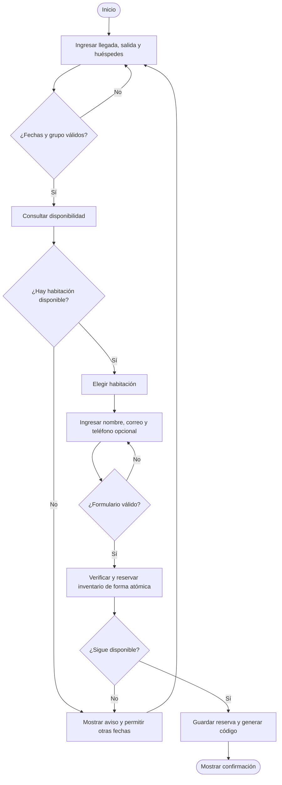
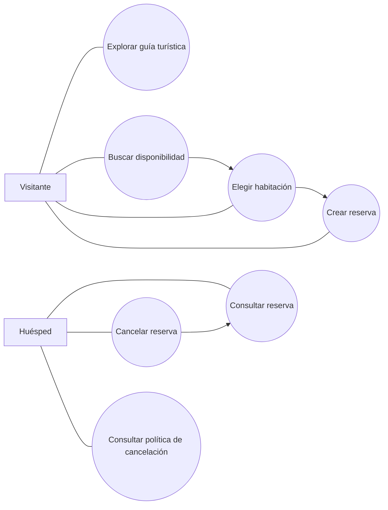
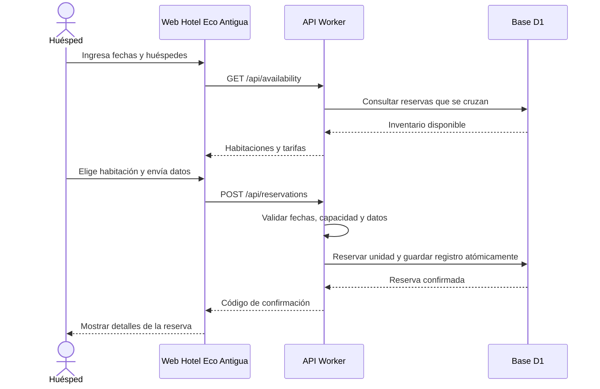
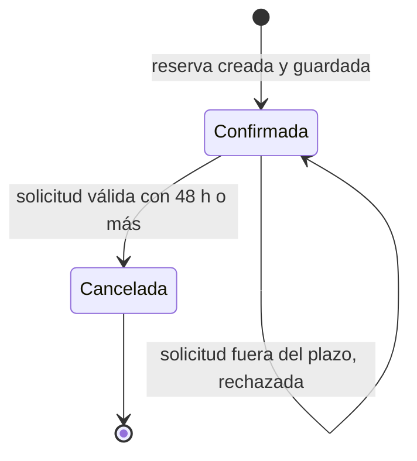

# Diagramas funcionales — Hotel Eco Antigua

Estos diagramas acompañan los diagramas de arquitectura de contexto y contenedores en `FASE1_DESCRIPCION_Y_DISENO.md`. Las versiones gráficas también están en el anexo E del PDF de fase 1.

## E-01. Flowchart del proceso de reserva

## E-02. Diagrama de casos de uso

## E-03. Diagrama de secuencia de reserva

## E-04. Diagrama de estados de una reserva

Los resultados de pruebas y defectos no aparecen en estos diagramas: deben documentarse a partir de ejecuciones reales del equipo.
