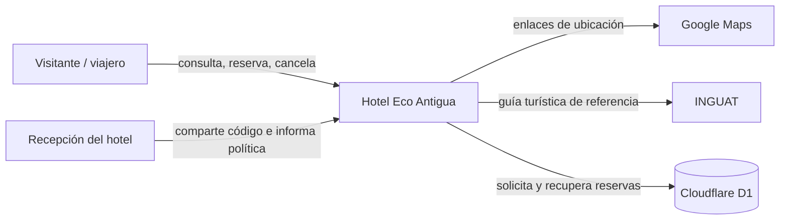
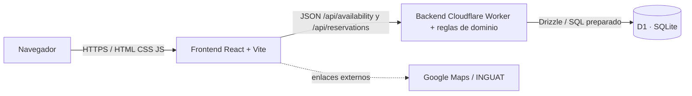

# Fase 1 — descripción, arquitectura y diseño de pruebas

**Proyecto:** Hotel Eco Antigua  
**Curso:** Aseguramiento de la Calidad de Software — Proyecto Final 2026  
**Universidad:** Universidad Mariano Gálvez de Guatemala  
**Integrante A:** [Ceily Estela García Gonzales] | **Carné A:** [0900-20-12736]  
**Integrante B:** [Diana Lissette Reyes Hernández] | **Carné B:** [0900-20-19623]  
**Roles:** Integrante A — Analista de Pruebas; Integrante B — Automatización y Plataforma/DevOps  
**Versión del documento:** 1.0 · **Fecha de revisión:** [25/09/2026]

> Antes de entregar: completa nombres, carné, repositorio, URL de despliegue, herramienta de pruebas y resultados reales. Los objetivos de carga y calidad son criterios que el equipo debe medir; no son resultados obtenidos.

## Índice

1. Descripción de la aplicación
2. Casos de uso
3. Requerimientos funcionales y no funcionales
4. Arquitectura a alto nivel
5. Casos de prueba y trazabilidad
6. Ejecución, defectos y resultados pendientes
7. Fuentes y declaración de uso de IA

## 1. Descripción de la aplicación

Hotel Eco Antigua es una aplicación web de reservas para un hotel conceptual de Antigua Guatemala. Sus usuarios son viajeros que comparan fechas, habitaciones y capacidad, además de huéspedes que consultan o cancelan una reserva. El contenido informativo ayuda a planear una visita a los monumentos de la ciudad y a comunidades cercanas de Sacatepéquez.

La aplicación aplica lógica de negocio más allá de operaciones básicas de datos: duración mínima y máxima, fechas reales y futuras, capacidad por habitación, precios por noche, inventario por intervalo de fechas, prevención de sobreventa en una sola operación de base de datos, normalización de correo, código de confirmación y transición de estado con límite de cancelación de 48 horas. No incluye pagos ni una cuenta de usuario.

Los nombres de habitación, tarifas en quetzales, cantidad de unidades y política de cancelación son valores demostrativos. Deben confirmarse con el hotel antes de recibir huéspedes.

### Origen y línea base

Aplicación propia generada con ChatGPT/Codex para este proyecto. No hay repositorio anterior y la línea base del origen es **0 pruebas automatizadas y 0 % de cobertura reportada**. Las pruebas que se añadan en este equipo deben quedar visibles en commits propios. Antes de entregar, registrar URL de los repositorios de clase, licencia elegida y evidencia de acceso para el catedrático.

| Capa | Tecnología | Ubicación |
| --- | --- | --- |
| Frontend | React, Vite, TypeScript, CSS responsivo | `frontend/`; comando independiente `pnpm run build:frontend` |
| API/backend | Cloudflare Worker y rutas JSON escritas en JavaScript | `backend/`; comando independiente `pnpm run build:backend` |
| Datos | Cloudflare D1 (SQLite), Drizzle ORM y migraciones | `db/`, `drizzle/` |
| Plataforma | Node.js, Git, GitHub Actions, Cloudflare Workers/Sites | `package.json`, `.github/`, `.openai/` |
| APIs de terceros | No hay APIs transaccionales. Los enlaces de ubicación abren Google Maps; INGUAT se enlaza como fuente de la guía. | `frontend/src/attractions.ts` |

## 2. Casos de uso principales

### UC-01 Buscar disponibilidad

**Actor:** viajero. **Precondición:** la aplicación y D1 están disponibles. **Flujo principal:** indica llegada, salida y huéspedes; solicita búsqueda; el sistema valida fechas y grupo, consulta reservas que se cruzan con el intervalo y presenta habitaciones disponibles con tarifa por noche. **Alternos:** fechas ausentes o inválidas producen un mensaje de validación; si todas las habitaciones están agotadas se ofrece probar otras fechas; si D1 no responde se informa que no se pudo consultar.

### UC-02 Elegir una habitación

**Actor:** viajero. **Precondición:** UC-01 devolvió al menos una habitación apta y disponible. **Flujo principal:** revisa nombre, capacidad, servicios demostrativos y tarifa; elige la habitación y el sistema muestra el formulario de huésped con las fechas seleccionadas. **Alternos:** una habitación agotada se muestra deshabilitada; si la consulta vence, el huésped puede volver a buscar.

### UC-03 Crear una reserva

**Actor:** viajero. **Precondición:** fechas y habitación seleccionadas; formulario visible. **Flujo principal:** ingresa nombre y correo, teléfono opcional; envía; el servidor normaliza el correo, valida límites, calcula total, verifica y descuenta inventario de forma atómica, guarda la reserva confirmada y muestra código. **Alternos:** campos inválidos se explican; si se agotó durante el formulario, la API responde conflicto y pide consultar de nuevo; si el servicio falla, no se afirma que la reserva quedó guardada.

### UC-04 Consultar una reserva

**Actor:** huésped. **Precondición:** posee el código de ocho caracteres y el mismo correo registrado. **Flujo principal:** ingresa ambos datos; el sistema compara las dos credenciales de búsqueda y muestra habitación, fechas, huéspedes, total y estado. **Alternos:** formato incorrecto se valida; código o correo que no coinciden generan un mensaje genérico sin revelar si uno de los datos era correcto.

### UC-05 Cancelar una reserva

**Actor:** huésped. **Precondición:** reserva confirmada, código y correo coincidentes. **Flujo principal:** consulta la reserva, selecciona cancelar, el servidor verifica estado y ventana de 48 horas, cambia estado a cancelada y confirma. **Alternos:** dentro de las 48 horas se rechaza; una reserva cancelada no se reactiva ni cancela otra vez.

### UC-06 Explorar sitios de Antigua

**Actor:** visitante. **Precondición:** página disponible. **Flujo principal:** abre la sección de guía, consulta atractivos del centro histórico, lee su descripción y accede a fuentes de INGUAT. **Alternos:** si un enlace externo no abre, la información descriptiva permanece disponible; se recuerda confirmar horarios y acceso.

### UC-07 Explorar pueblos cercanos

**Actor:** visitante. **Precondición:** página disponible. **Flujo principal:** recorre los sitios de San Juan del Obispo, San Antonio Aguas Calientes y Ciudad Vieja; abre indicaciones en un servicio de mapas. **Alternos:** conexión externa no disponible: usa la descripción y confirma el trayecto por separado.

### UC-08 Navegar la aplicación en móvil y teclado

**Actor:** visitante con móvil, lector de pantalla o teclado. **Precondición:** navegador compatible. **Flujo principal:** usa la navegación por secciones, completa fechas y formularios con etiquetas, opera controles por teclado y consulta mensajes anunciados. **Alternos:** con movimiento reducido activado no se fuerza el desplazamiento animado; con pantalla angosta el contenido se reacomoda sin desplazamiento horizontal.

## 3. Requerimientos funcionales

| ID | Requerimiento | Casos de uso |
| --- | --- | --- |
| RF-01 | El sistema aceptará búsqueda con fechas ISO válidas, llegada no pasada, entre 1 y 30 noches, y de 1 a 5 huéspedes enteros. | UC-01 |
| RF-02 | El sistema mostrará solo los tipos cuya capacidad admita al grupo y calculará el total como tarifa demostrativa multiplicada por noches. | UC-01, UC-02 |
| RF-03 | El sistema descontará unidades con reservas pendientes o confirmadas cuyos intervalos se traslapen; una cancelada no ocupará inventario. | UC-01, UC-03 |
| RF-04 | El sistema creará reserva confirmada solo con nombre, correo válido, habitación y fechas válidas; una sola sentencia comprobará inventario y creará el registro. | UC-03 |
| RF-05 | El sistema generará y mostrará un código de confirmación de ocho caracteres sin caracteres ambiguos. | UC-03, UC-04 |
| RF-06 | El sistema consultará una reserva solo cuando código y correo coincidan; no tendrá endpoint para listar datos personales. | UC-04 |
| RF-07 | El sistema permitirá cancelar la reserva confirmada al menos 48 horas antes de la llegada y liberará su inventario. | UC-05 |
| RF-08 | El sistema bloqueará cancelaciones fuera del plazo, repetidas o de estados terminales. | UC-05 |
| RF-09 | La página presentará al menos diez puntos de interés de Antigua y alrededores, descripciones en español y enlaces de ubicación. | UC-06, UC-07 |
| RF-10 | Navegación, formularios y resultados estarán etiquetados para teclado y tecnologías de asistencia y se reorganizarán en pantallas pequeñas. | UC-08 |

## 4. Requerimientos no funcionales medibles

Estos son **umbrales objetivo** para comprobar en el ambiente y configuración registrados. No presentar un objetivo como resultado medido.

| ID | Requerimiento medible | Verificación |
| --- | --- | --- |
| RNF-01 | En la prueba E14, `/api/availability` y `/api/reservations` mantendrán percentil 95 de latencia menor de 2,000 ms, con 50 VU sostenidos por 5 min luego de la rampa. | Reporte k6 con URL, región, tamaño de datos y fecha. |
| RNF-02 | En el mismo escenario la tasa de solicitudes fallidas será menor de 1 %. | Umbral `http_req_failed < 0.01`; investigar errores del servidor y estados inesperados. |
| RNF-03 | En ancho de 360 px no habrá desbordamiento horizontal; la navegación, búsqueda, selección y consulta de reserva se completarán solo con teclado; axe reportará cero hallazgos serios o críticos. | Capturas a 360 px, recorrido de teclado y reporte axe. |
| RNF-04 | Un intento de consultar o cancelar una reserva con correo incorrecto nunca devolverá datos de la reserva; el API retornará 404 y no expondrá endpoint de listado. | Colección Postman y revisión de rutas. |
| RNF-05 | Una reserva persistirá tras recargar la página y reiniciar el proceso de aplicación; D1 guardará el registro y la consulta por código/correo devolverá el mismo estado. | Prueba API antes y después de reinicio/despliegue, con evidencia sin exponer correo completo. |
| RNF-06 | El monitoreo sintético del URL público tendrá al menos 99 % de respuestas HTTP válidas durante siete días de medición. | Historial de monitoreo, ventana exacta y cálculo del porcentaje. |

## 5. Arquitectura a alto nivel

### Diagrama de contexto

### Diagrama de contenedores

### Diagramas funcionales

El anexo E del PDF incluye los diagramas gráficos del flujo de reserva, casos de uso, secuencia entre navegador/API/base de datos y estados de una reserva. Su fuente editable Mermaid está en [`DIAGRAMAS.md`](DIAGRAMAS.md).

### Dependencias y datos

No se captura información de pago ni se llama a un procesador externo. Google Maps recibe la consulta de ubicación al abrir el enlace del usuario; la guía de turismo usa mapas y guía de INGUAT. D1 es el único almacenamiento de reservas.

**Entidad `reservations`:** `id` (UUID, clave primaria), `confirmation_code` (único), `guest_name`, `guest_email`, `guest_phone` (opcional), `room_type`, `check_in`, `check_out`, `guests`, `total`, `status`, `created_at`. Los intervalos se interpretan como `[llegada, salida)`, de modo que dos estancias consecutivas pueden compartir día de salida/llegada. Los índices sirven a consulta de habitación por estado/fechas y búsqueda por código/correo.

**Módulos críticos para E10:** (1) reglas de fecha, capacidad y cálculo, porque un error permite datos o cobros equivocados; (2) control de disponibilidad y reserva atómica, porque una sobreventa compromete alojamiento; (3) búsqueda/cancelación por código y correo, porque una exposición o transición incorrecta afecta datos personales e inventario; (4) esquema y persistencia D1, porque pérdida o lectura inconsistente rompe la operación.

## 6. Casos de prueba y trazabilidad

Se diseñaron **36 casos de prueba**, 9 por cada una de las cuatro técnicas exigidas. Cada caso contiene ID, requerimiento, técnica, precondición, datos, pasos, resultado esperado y prioridad. La importación editable está en [`matriz_casos_prueba.csv`](matriz_casos_prueba.csv). La matriz editable requisito–prueba–ejecución–defecto–estado está en [`trazabilidad.csv`](trazabilidad.csv). Los IDs CP-01 a CP-36 se deben copiar a TestLink, Jira/Xray o Azure Test Plans.

Los casos de prueba cubren particiones válidas e inválidas de fecha, correo, huéspedes y habitación; valores frontera de noches, capacidad, fecha y plazo de cancelación; tabla de decisión de capacidad/traslape/estado; y transición confirmada→cancelada con cancelada como estado terminal. La columna de ejecución queda `PENDIENTE` hasta que el equipo la ejecute en el ambiente registrado.

## 7. Ejecución, defectos y resultados

**Herramienta elegida:** [TestLink / Jira con Xray o Zephyr / Azure DevOps Test Plans].  
**Ambiente:** [URL, versión/commit, fecha, navegador, base de datos].  
**Casos diseñados:** 36. **Ejecutados:** [completar]. **Aprobados:** [completar]. **Fallidos:** [completar]. **Bloqueados:** [completar].  
**Tasa de aprobación:** aprobados ÷ ejecutados × 100 = [completar].  
**Defectos por severidad y densidad por módulo:** [completar con los defectos verificados].

No se declaran defectos observados todavía. Usa [`defectos.csv`](defectos.csv) y [`EVIDENCIA_Y_DEFECTOS.md`](EVIDENCIA_Y_DEFECTOS.md) para registrar diez hallazgos reales con pasos, resultado esperado/obtenido, prioridad, severidad y evidencia. No cuentes una hipótesis como defecto ni inventes capturas.

## 8. Fuentes y declaración de IA

- INGUAT, [Mapa turístico de Antigua Guatemala](https://inguat.gob.gt/es/descargas-inguat-guatemala/41-mapas.html?download=1165%3Amapa-turistico-de-antigua-guatemala-espanol-marzo-2026).
- INGUAT, [Guía turística de Sacatepéquez 2026](https://inguat.gob.gt/es/descargas-inguat-guatemala/46-guias-turisticas.html?download=1148%3Aguia-turistica-de-sacatepequez-2026).
- UNESCO, [Antigua Guatemala — Patrimonio Mundial](https://whc.unesco.org/en/list/65/).

**Declaración:** ChatGPT/Codex se utilizó para generar el prototipo web, el primer borrador de requisitos, arquitectura, casos de prueba, guías de ejecución y plantillas automatizadas. El equipo debe revisar el comportamiento, ajustar valores e información, incorporar sus propias pruebas, validar fuentes y declarar sus contribuciones en Git. La IA no ejecutó TestLink, Sonar, el pipeline del equipo, despliegue del equipo ni prueba k6; registra sus resultados solo después de hacerlos.
